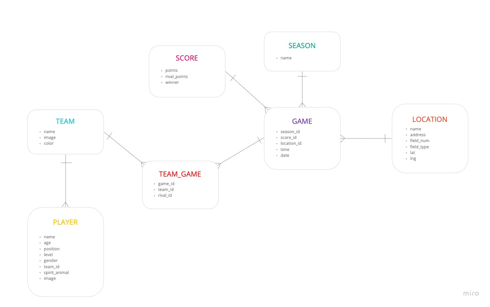

# Module 3 Ultimate Frisbee App - Backend  

This mod 3 fullstack app was created with the purpose of creating the ability to schedule games and keep track of the roster for the Flatiron Flyers Ultimate Frisbee Team. 

---

## How the app works  

* This project uses Ruby on Rails. If you do not already have Ruby installed, you can do so here: https://www.ruby-lang.org/en/documentation/installation/

* Once you have Ruby installed, you can fork and then clone down this repo to your local device. 
   * In your terminal you will need to run: 
        * `bundle install` 
        * `rails db:migrate`
        * `rails db: seed`
        * `rails s (runs your server)` 
        
* Once you have your backend server running, you can go into the frontend repo which you can view at: https://github.com/miwhag/ultimate-frontend,  and follow the instructions there. 

### ERD 
Stands for Entity Relationship Diagram and is the structural model for my database design. 

### Technologies 

* Ruby on Rails 
* Ruby version 2.6.1
* Postman 

### Authors

* Miwha Geschwind - [Github Repo](https://github.com/miwhag)

