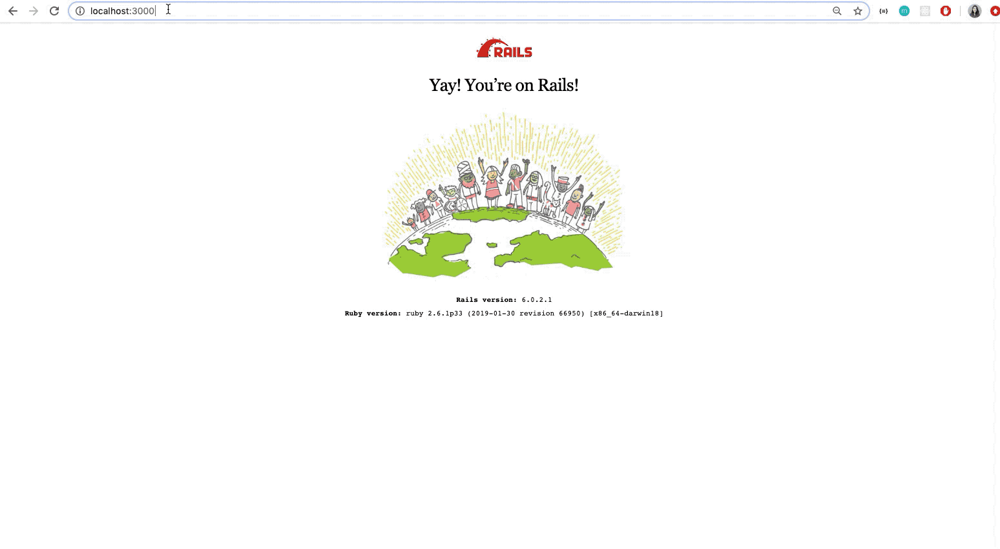
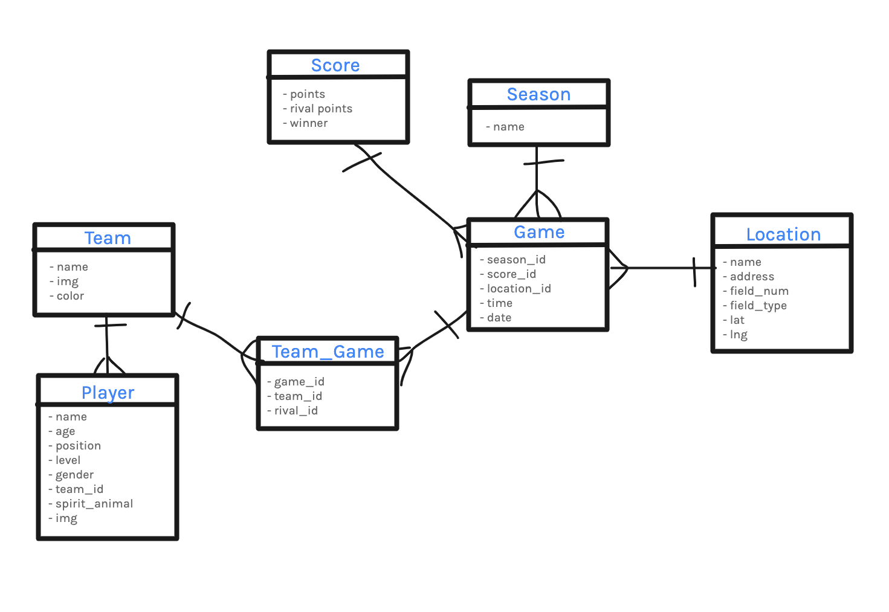

# Module 3 Ultimate Frisbee App - Backend  

This mod 3 fullstack app was created with the purpose of creating the ability to schedule games and keep track of the roster for the Flatiron Flyers Ultimate Frisbee Team. 

---

## How the app works  

* To run the app, first fork and clone down this repo to your local device. 
   * In your terminal you will need to type: 
        * bundle install 
        * rails db:migrate 
        * rails db: seed
        * rails s (runs your server) 
        
* Once you have your backend server running, you can go into the frontend repo which you can view at: https://github.com/miwhag/ultimate-frontend,  and follow the instructions there. 

### ERD 

### Technologies 

* Ruby on Rails 
* Ruby 
* Postman 

### Authors

* Miwha Geschwind - [Github Repo](https://github.com/miwhag)

